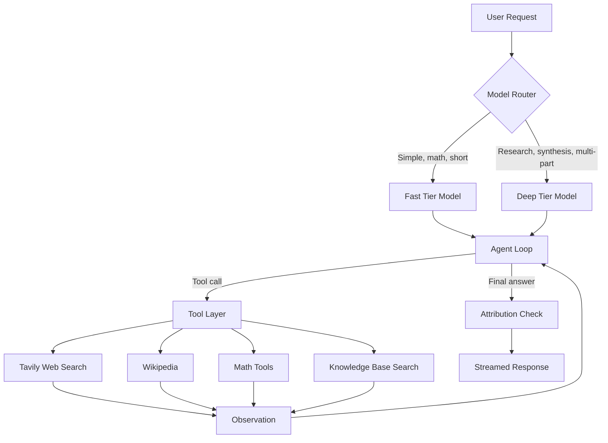
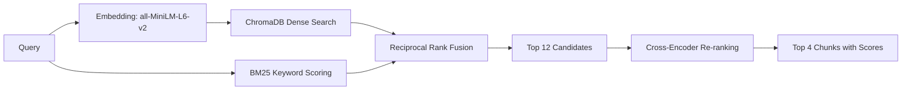

# Vault

**An autonomous, tool-using AI agent with dynamic model routing, two-stage retrieval-augmented generation, live web search, and automated source attribution, served through a User friendly web interface.**

A Vault is a single-file, production-oriented Google Colab application built on LangChain, the Groq inference API, ChromaDB, and Gradio. It combines a tiered language-model router, a deterministic tool suite, and a hybrid retrieval pipeline into one agent that grounds its answers in retrieved evidence and cites every source it uses.

---


---

## Table of Contents

1. [Overview](#overview)
2. [Key Features](#key-features)
3. [System Architecture](#system-architecture)
4. [Technology Stack](#technology-stack)
5. [Getting Started](#getting-started)
6. [Configuration](#configuration)
7. [Usage](#usage)
8. [Component Reference](#component-reference)
9. [Source Attribution](#source-attribution)
10. [Error Handling and Resilience](#error-handling-and-resilience)
11. [Security Considerations](#security-considerations)
12. [Known Limitations](#known-limitations)
13. [Troubleshooting](#troubleshooting)
14. [Roadmap](#roadmap)
15. [Contributing](#contributing)
16. [License](#license)

---

## Overview

Large language models are fluent but unreliable when asked about current events, exact arithmetic, or private documents. A Vault addresses this by placing the model inside an agentic loop: the model reasons about the request, selects a tool, observes the result, and repeats until it can answer from verified evidence.

The system is designed around three principles:

- **Grounding.** Real-world facts, dates, news, and calculations are resolved through tools, never from the model's parametric memory alone.
- **Attribution.** Every externally sourced claim is accompanied by an explicit, formatted source tag.
- **Efficiency.** A lightweight router dispatches simple requests to a fast model and complex requests to a deeper reasoning model, minimizing latency without sacrificing quality.

---

## Key Features

| Capability | Description |
|---|---|
| Dynamic model routing | Heuristic intent classifier assigns each request to a fast or deep model tier, with manual override. |
| Streaming responses | Token-by-token output rendered in the interface as the model generates it. |
| Two-stage RAG | Hybrid dense and sparse retrieval followed by cross-encoder re-ranking on the GPU. |
| Live web search | Real-time retrieval through the Tavily search API. |
| Encyclopedic lookup | Wikipedia integration for historical, biographical, and scientific queries. |
| Deterministic mathematics | Exact `add`, `multiply`, and a sandboxed arithmetic evaluator built on the Python AST. |
| Automated attribution | Source tags are injected into tool outputs and enforced by a post-generation check. |
| Tool inspection | Each tool call is displayed as a collapsible panel showing arguments and results. |
| Postman-themed interface | Dark developer-oriented UI with a status bar, latency gauge, and active-model badge. |
| Fault tolerance | Defensive error handling around every tool and automatic fallback to the deep-tier model. |

---

## System Architecture



### Retrieval Pipeline



**Stage 1 - Hybrid retrieval.** The query is embedded with `sentence-transformers/all-MiniLM-L6-v2` and matched against a ChromaDB collection using cosine similarity. In parallel, BM25 scores every chunk on keyword overlap. Both rankings are merged with Reciprocal Rank Fusion (constant of 60), and the top 12 candidates advance.

**Stage 2 - Re-ranking.** The candidates are re-scored with the `cross-encoder/ms-marco-MiniLM-L-6-v2` cross-encoder, executed on the GPU when available. The four highest-scoring chunks are returned to the agent with their scores.

---

## Technology Stack

| Layer | Technology |
|---|---|
| Orchestration | LangChain, LangChain Core, LangChain Community |
| Inference | Groq API via `langchain-groq` |
| Embeddings | `sentence-transformers/all-MiniLM-L6-v2` |
| Vector store | ChromaDB (in-memory) |
| Sparse retrieval | `rank_bm25` (BM25Okapi) |
| Re-ranking | `cross-encoder/ms-marco-MiniLM-L-6-v2` |
| Web search | Tavily |
| Encyclopedia | Wikipedia |
| Document parsing | `pypdf`, `langchain-text-splitters` |
| Interface | Gradio (compatible with versions 5 and 6) |
| Runtime | Google Colab, Python 3, NVIDIA T4 GPU recommended |

---

## Getting Started

### Prerequisites

- A Google account with access to Google Colab.
- A Groq API key, available from the Groq console.
- A Tavily API key, available from the Tavily dashboard (required only for web search).
- A GPU runtime is recommended. The script runs on CPU but re-ranking and embedding will be slower.

### Installation

1. Open a new notebook in Google Colab.
2. Select **Runtime**, then **Change runtime type**, and choose **T4 GPU**.
3. Add your API keys as Colab Secrets (see [Configuration](#configuration)).
4. Copy the contents of `groq_agent_colab.py` into a single notebook cell.
5. Run the cell.

The script installs all dependencies silently, loads the retrieval models, and launches the interface. A public Gradio URL is printed on completion.

> If a previous session already loaded a different Gradio version, restart the runtime (**Runtime**, then **Restart session**) and run the cell again.

---

## Configuration

### API Keys

Keys are resolved in the following order:

1. Google Colab Secrets (`google.colab.userdata`)
2. Environment variables
3. Interactive runtime prompt

| Key | Purpose | Required |
|---|---|---|
| `GROQ_API_KEY` | Language model inference | Yes |
| `TAVILY_API_KEY` | Live web search | Yes |

To add a Colab Secret, open the key icon in the left sidebar, create a secret with the exact name above, and enable notebook access.

### Model Selection

Model identifiers are defined as constants near the top of the script:

```python
FAST_MODEL = "openai/gpt-oss-20b"
DEEP_MODEL = "openai/gpt-oss-120b"
```

Hosted model catalogs change over time. If a request returns a `model_not_found` error, consult the provider's model and deprecation documentation and update these two constants.

### Tunable Parameters

| Parameter | Location | Default | Description |
|---|---|---|---|
| `MAX_STEPS` | Agent loop | 6 | Maximum reasoning and tool iterations per request. |
| Chunk size and overlap | Text splitter | 800 / 100 | Character length of knowledge base chunks. |
| Candidate pool | `retrieve()` | 12 | Chunks passed to the re-ranker. |
| Top K | `retrieve()` | 4 | Chunks returned to the agent. |
| Temperature | Interface slider | 0.3 | Sampling temperature, adjustable per request. |

---

## Usage

### Interface Layout

- **Top navigation bar.** Displays API connection status, time-to-first-token latency with a gauge, the active model badge, and the current agent state.
- **Left control panel.** Model selection (Auto, fast tier, or deep tier), temperature control, a live tool activity log, and the knowledge base ingestion controls.
- **Main panel.** The streaming conversation view with tool call inspection panels and source attribution.

### Working with the Knowledge Base

1. Upload one or more `.txt`, `.md`, `.pdf`, or `.csv` files, or paste text directly.
2. Select **Ingest**. The status field reports the number of chunks indexed.
3. Ask questions that reference your documents. The router automatically favors the deep tier for document queries.
4. Select **Clear KB** to remove all indexed content.

### Example Queries

| Intent | Example |
|---|---|
| Current events | What are the latest developments in AI accelerators this week? |
| Encyclopedic | Who was Ada Lovelace and what was her contribution to computing? |
| Arithmetic | Calculate (1234.5 * 67) / 3 + 89 ** 2 |
| Deep analysis | Compare transformer and recurrent architectures in depth. |
| Document query | Summarize the uploaded document. |

---

## Component Reference

### Model Router

The router scores each request using lightweight heuristics:

| Signal | Effect |
|---|---|
| Analytical keywords (compare, analyze, research, synthesize, and similar) | Favors deep tier |
| References to uploaded documents or the knowledge base | Favors deep tier |
| Long queries (over 45 words) | Favors deep tier |
| Multi-part queries | Favors deep tier |
| Short arithmetic queries | Favors fast tier |

A total score of two or more selects the deep tier. The selected model and the reason are written to the tool activity log.

### Tool Suite

| Tool | Function | Backend |
|---|---|---|
| `web_search` | Current events and breaking information | Tavily (three results per query) |
| `wikipedia` | Historical, biographical, and scientific facts | Wikipedia (top two articles, 1,500 characters each) |
| `add` | Exact addition | Python |
| `multiply` | Exact multiplication | Python |
| `calculate` | Safe arithmetic expression evaluation | Restricted AST evaluator |
| `search_knowledge_base` | Query ingested local documents | Two-stage RAG pipeline |

The `calculate` tool never uses `eval` on raw input. It parses the expression into an abstract syntax tree and permits only numeric literals and a fixed set of arithmetic operators, with an exponent limit to prevent resource exhaustion.

### Agent Loop

The loop is implemented explicitly rather than through a prebuilt executor, which keeps behavior stable across LangChain releases. On each iteration the model streams a response; if it emits tool calls, the loop executes them, appends the results as tool messages, and continues until the model returns a final answer or the step limit is reached.

---

## Source Attribution

Every tool result ends with a pre-formatted source line, and the system prompt instructs the model to reproduce the relevant lines in its answer. Tags are rendered as Markdown blockquotes:

| Source type | Format |
|---|---|
| Web search | `> Source: Tavily Web Search (Title - URL)` |
| Wikipedia | `> Source: Wikipedia (Article Title)` |
| Knowledge base | `> Source: Ingested Knowledge Base (Chunk ID - File - Score)` |
| Calculation | `> Verified via Math Tool: expression = result` |

Each tag is prefixed with a category icon in the running application. As a safeguard, after generation completes the system compares the sources used against the final answer. Any source the model failed to cite is appended in a **Sources used** footer, so attribution does not depend solely on model compliance.

---

## Error Handling and Resilience

- Every tool executes inside a `try/except` boundary. Failures return a descriptive error string to the model rather than terminating the session.
- If the fast-tier model fails or produces a malformed tool call, the request is retried once on the deep-tier model.
- Network errors and rate limits surface as readable messages in the conversation and the activity log.
- The Tavily integration falls back from the LangChain community tool to the native Tavily client if the former is unavailable.
- Ingestion errors are reported in the interface without corrupting the existing index.

---

## Security Considerations

- **Secrets.** Never hard-code API keys. Use Colab Secrets or environment variables, and never commit keys to version control.
- **Public tunnel.** The application launches with `share=True`, which exposes a public URL for the lifetime of the session. Anyone with the link can use the agent and consume your API quota. Set `share=False` or close the session when finished.
- **Uploaded content.** Documents you ingest are processed in memory within the Colab session and are not persisted. Content retrieved from documents or the web is passed to the model and should be treated as untrusted input.
- **Behavior.** The system prompt directs the agent to answer directly and to omit boilerplate disclaimers. It does not override the safety behavior built into the underlying models.

---

## Known Limitations

- The vector store is in-memory. The knowledge base is lost when the Colab session ends.
- The router is heuristic and will occasionally misclassify borderline requests. Use the manual override when needed.
- Conversation state is held in the browser session and is not persisted across restarts.
- Free-tier API usage is subject to provider rate limits.
- Reasoning-class models may introduce a short delay before the first token.
- The tool activity log is shared at the process level and is intended for single-user sessions.

---

## Troubleshooting

| Symptom | Likely cause | Resolution |
|---|---|---|
| `model_not_found` (404) | Model retired or unavailable to your account | Update `FAST_MODEL` and `DEEP_MODEL` to current identifiers. |
| API status shows an error | Missing or invalid `GROQ_API_KEY` | Verify the secret name and that notebook access is enabled. |
| Web search returns an error | Missing `TAVILY_API_KEY` | Add the key, or proceed without web search. |
| `Chatbot.__init__() got an unexpected keyword argument` | Gradio version mismatch | Restart the runtime and rerun. The script adapts to Gradio 5 and 6. |
| Collection name validation error | ChromaDB naming rules | Collection names must be at least three characters. |
| Slow re-ranking | Running on CPU | Switch the runtime to a T4 GPU. |

---

## Roadmap

- Persistent vector storage with on-disk ChromaDB.
- Conversation memory and session export.
- Configurable router with an optional model-based classifier.
- Additional document loaders (DOCX, HTML, web pages).
- Evaluation harness for retrieval quality and attribution accuracy.
- Optional authentication for the public interface.

---

## Contributing

Contributions are welcome. To propose a change:

1. Fork the repository.
2. Create a feature branch: `git checkout -b feature/your-feature`.
3. Commit your changes with clear, descriptive messages.
4. Push the branch and open a pull request describing the change and its motivation.

Please keep changes focused, document new configuration options in this README, and confirm that the script runs end to end in a fresh Colab session.

---

## License

Distributed under the MIT License. Add a `LICENSE` file to the repository root before publishing.
